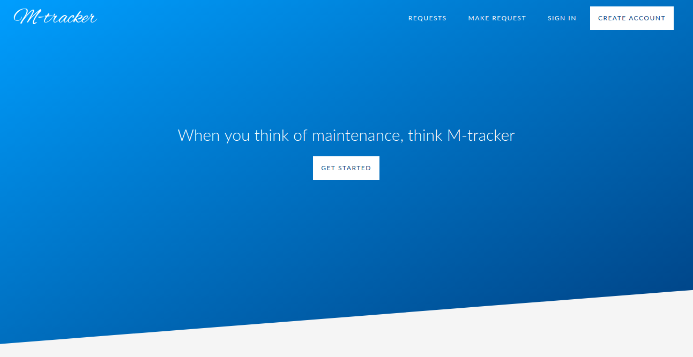

[](https://travis-ci.org/DennisWanjiru/maintenance-tracker) [](https://coveralls.io/github/DennisWanjiru/maintenance-tracker?branch=ft-api-endpoints-157964345)  

### _Landing page_



# Maintenance Tracker Application

An application that helps users make requests for maintenance/repair services.
The admin of the application receives the request and either approves or disapproves it. If the request is approved the user is notified and he/she gets the appropriate services as requested. User can also track his/her requests.

## Usage

* Create an account and login

* Make a request

* Request is aprroved or disapproved

* If approved you get served

## Installation

_Download the project to your local computer through_

* Download a zip folder of this repository
* Unzip it and navigate into the ui directory
* Open `index.html` in a browser (Google Chrome is preferred for better experience) :sunglasses:.

### Alternatively

_Run the following command_

```
$ git clone git@github.com:DennisWanjiru/maintenance-tracker.git
```

* Locate a folder named maintenance-tracker in your computer
* Open `index.html` in a browser (Google Chrome is preferred for better experience) :sunglasses:.

## API

### Prerequisites

[Python 3.6](https://www.python.org/downloads/release/python-360/)
[Virtual Environment](https://packaging.python.org/guides/installing-using-pip-and-virtualenv/)
[Flask](http://flask.pocoo.org/)
[Flask-RESTful](https://flask-restful.readthedocs.io/en/latest/)

### ENDPOINTS

| METHOD | ENDPOINT                                | DESCRIPTION                      |
| ------ | --------------------------------------- | -------------------------------- |
| GET    | /api/v1/users/requests/                 | Fetch all the requests resources |
| GET    | /api/v1/users/request/<int:request_id>/ | Fetch a single request resource  |
| POST   | /api/v1/users/requests/                 | Create a new request             |
| PUT    | /api/v1/users/request/<int:request_id>/ | Update a specific request        |
| DELETE | /api/v1/users/request/<int:request_id>/ | Delete a specific request        |
| POST   | /api/v1/users/auth/signup/              | Handle user registration         |
| POST   | /api/v1/users/auth/signin/              | Handle user login                |

## Technologies & Languages

**Project management (Agile)** [https://www.pivotaltracker.com](url)

**Version control (Git)** [https://git-scm.com/](url)

**SVG icons (Feathers icons)** [https://icomoon.io/](url)

**HTML5**

**CSS3**

## Contributing

1.  Fork the repository

2.  Clone the repository to your local computer

```
$ git clone git@github.com:DennisWanjiru/maintenance-tracker.git

$ cd maintenance-tracker

$ git fetch --all

$ git pull --all
```

## Authors

Dennis Wanjiru

## License

MIT

## Acknowledgement

Andela Bootcamp - cohort 28
